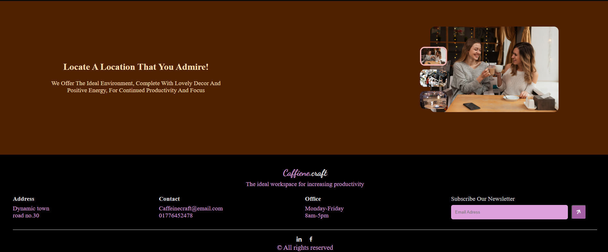

# ☕ CaffeineCraft

Caffeine Craft is a responsive coffee-themed website built with **React**. It features a modern UI with smooth animations, category-based filtering, and interactive components, all crafted to provide an enjoyable browsing experience for coffee lovers.

## Live Demo
👉 [View the Live Site](https://caffeine-craft.netlify.app/)

## Screenshots

### 🏠 Homepage Hero Section

### 📦 Menu-Items

### 🔻 Location and Footer

## Features

- **Header:** Features a sticky navigation bar with smooth scroll effects.
- **Hero (Star) Section:** A clean and inviting hero area that encourages users to explore and place an order.
- **Coffee Categories:** A unique section showcasing various coffee types to enhance discoverability and visual appeal.
- **Items Component:** Displays a dynamic list of drinks, meals, and desserts using JSON data. It includes: category-based filtering
- **Place Component:** Allows users to switch dynamically between different location images.
- **Animations:** Implemented with **React Reveal** to create smooth transitions.
- **Footer:** A simple yet elegant footer wraps up the site, completing the user journey.

## Tech Stack

- **Frontend:** React.js, JavaScript
- **Styling:** Plain CSS
- **Animations:** React Reveal
